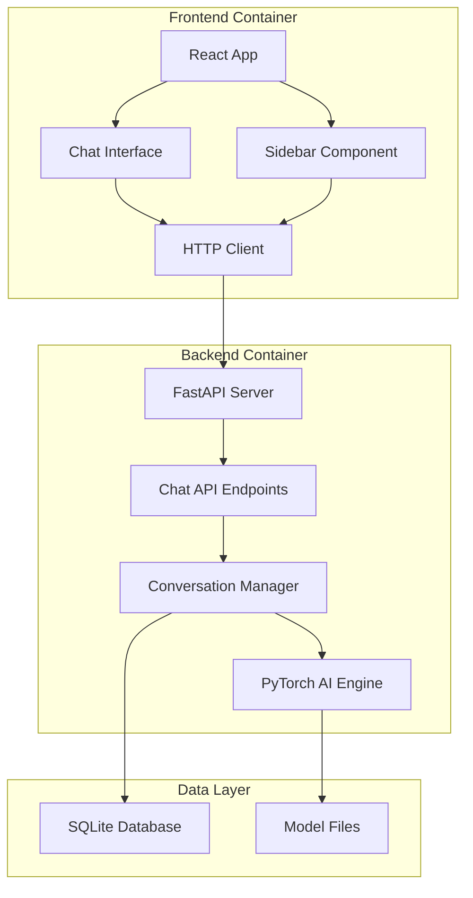

# Design Document

## Overview

The AI Chatbot Application is a full-stack web application that enables users to interact with an AI assistant through a modern chat interface. The system consists of three main components: a React frontend for the user interface, a FastAPI backend for API services, and a PyTorch-based AI engine for language model inference. The application supports multiple conversation management through a sidebar interface and maintains conversation history persistence.

## Architecture

### High-Level Architecture



### Technology Stack

- **Frontend**: React 18 with TypeScript, Axios for HTTP requests, CSS Modules for styling
- **Backend**: FastAPI with Python 3.11, Pydantic for data validation, SQLAlchemy for database ORM
- **AI Engine**: PyTorch 2.0+, Transformers library for model loading, Tokenizers for text processing
- **Database**: SQLite for conversation persistence (development), PostgreSQL ready for production
- **Containerization**: Docker Compose with separate containers for frontend and backend
- **Development**: Hot reloading enabled for both frontend and backend

## Components and Interfaces

### Frontend Components

#### 1. App Component
- **Purpose**: Root component managing application state and routing
- **Props**: None
- **State**: Current conversation ID, user authentication status
- **Methods**: `switchConversation()`, `createNewConversation()`

#### 2. ChatInterface Component
- **Purpose**: Main chat area displaying messages and input field
- **Props**: `conversationId: string`, `messages: Message[]`
- **State**: Current message input, loading state, error state
- **Methods**: `sendMessage()`, `handleInputChange()`, `scrollToBottom()`

#### 3. Sidebar Component
- **Purpose**: Conversation list and navigation
- **Props**: `conversations: Conversation[]`, `activeConversationId: string`
- **State**: Conversations list, loading state
- **Methods**: `loadConversations()`, `deleteConversation()`, `selectConversation()`

#### 4. Message Component
- **Purpose**: Individual message display with user/AI differentiation
- **Props**: `message: Message`, `isUser: boolean`
- **State**: None (stateless component)
- **Methods**: `formatTimestamp()`, `renderMarkdown()`

### Backend API Endpoints

#### 1. Chat Endpoints
```python
POST /api/chat/send
- Request: {"conversation_id": str, "message": str}
- Response: {"response": str, "conversation_id": str, "timestamp": str}

GET /api/chat/conversations
- Response: {"conversations": [{"id": str, "title": str, "updated_at": str}]}

GET /api/chat/conversations/{conversation_id}
- Response: {"messages": [{"content": str, "is_user": bool, "timestamp": str}]}

POST /api/chat/conversations
- Request: {"title": str}
- Response: {"conversation_id": str, "title": str}

DELETE /api/chat/conversations/{conversation_id}
- Response: {"success": bool}
```

#### 2. Health Check Endpoints
```python
GET /api/health
- Response: {"status": "healthy", "model_loaded": bool}

GET /api/model/info
- Response: {"model_name": str, "model_size": str, "device": str}
```

### Database Schema

#### Conversations Table
```sql
CREATE TABLE conversations (
    id VARCHAR(36) PRIMARY KEY,
    title VARCHAR(255) NOT NULL,
    created_at TIMESTAMP DEFAULT CURRENT_TIMESTAMP,
    updated_at TIMESTAMP DEFAULT CURRENT_TIMESTAMP
);
```

#### Messages Table
```sql
CREATE TABLE messages (
    id INTEGER PRIMARY KEY AUTOINCREMENT,
    conversation_id VARCHAR(36) REFERENCES conversations(id),
    content TEXT NOT NULL,
    is_user BOOLEAN NOT NULL,
    timestamp TIMESTAMP DEFAULT CURRENT_TIMESTAMP
);
```

## Data Models

### Frontend TypeScript Interfaces

```typescript
interface Message {
  id: string;
  content: string;
  isUser: boolean;
  timestamp: string;
}

interface Conversation {
  id: string;
  title: string;
  updatedAt: string;
  messageCount?: number;
}

interface ChatState {
  conversations: Conversation[];
  activeConversationId: string | null;
  messages: Message[];
  isLoading: boolean;
  error: string | null;
}
```

### Backend Pydantic Models

```python
class MessageRequest(BaseModel):
    conversation_id: Optional[str] = None
    message: str

class MessageResponse(BaseModel):
    response: str
    conversation_id: str
    timestamp: datetime

class ConversationCreate(BaseModel):
    title: str

class ConversationResponse(BaseModel):
    id: str
    title: str
    updated_at: datetime
    message_count: int
```

## Error Handling

### Frontend Error Handling
- **Network Errors**: Display user-friendly messages with retry options
- **Validation Errors**: Show inline validation messages for form inputs
- **API Errors**: Parse backend error responses and display appropriate messages
- **Loading States**: Show spinners and disable inputs during API calls

### Backend Error Handling
- **Input Validation**: Use Pydantic models for request validation
- **Model Errors**: Catch PyTorch exceptions and return appropriate HTTP status codes
- **Database Errors**: Handle connection issues and constraint violations
- **Rate Limiting**: Implement request throttling to prevent abuse

### Error Response Format
```python
{
    "error": {
        "code": "VALIDATION_ERROR",
        "message": "Invalid input provided",
        "details": {"field": "message", "issue": "Message cannot be empty"}
    }
}
```

## Testing Strategy

### Frontend Testing
- **Unit Tests**: Jest and React Testing Library for component testing
- **Integration Tests**: Test API integration with mock backend
- **E2E Tests**: Cypress for full user workflow testing
- **Coverage**: Minimum 80% code coverage for critical components

### Backend Testing
- **Unit Tests**: pytest for individual function testing
- **API Tests**: FastAPI TestClient for endpoint testing
- **Model Tests**: Test PyTorch model loading and inference
- **Database Tests**: Test database operations with test database

### Test Data
- **Mock Conversations**: Pre-defined conversation data for testing
- **Model Mocks**: Lightweight model mocks for faster testing
- **API Mocks**: Mock external dependencies and services

## Performance Considerations

### Frontend Optimization
- **Code Splitting**: Lazy load components to reduce initial bundle size
- **Memoization**: Use React.memo and useMemo for expensive operations
- **Virtual Scrolling**: Implement for large conversation histories
- **Debouncing**: Debounce user input to reduce API calls

### Backend Optimization
- **Model Caching**: Keep model in memory to avoid reload overhead
- **Connection Pooling**: Use database connection pooling
- **Async Processing**: Use FastAPI's async capabilities for I/O operations
- **Response Streaming**: Stream AI responses for better user experience

### AI Model Optimization
- **Model Selection**: Use efficient models like DistilBERT or smaller Llama variants
- **Quantization**: Apply model quantization to reduce memory usage
- **Batch Processing**: Process multiple requests in batches when possible
- **GPU Utilization**: Optimize GPU usage for inference acceleration

## Security Considerations

### Input Validation
- **Message Sanitization**: Clean user inputs to prevent injection attacks
- **Length Limits**: Enforce maximum message and conversation limits
- **Rate Limiting**: Implement per-user rate limiting
- **CORS Configuration**: Properly configure CORS for frontend-backend communication

### Data Protection
- **Conversation Privacy**: Ensure conversations are isolated per user session
- **Data Encryption**: Encrypt sensitive data at rest and in transit
- **Session Management**: Implement secure session handling
- **Audit Logging**: Log important actions for security monitoring

## Deployment Configuration

### Docker Compose Structure
```yaml
version: '3.8'
services:
  frontend:
    build: ./frontend
    ports:
      - "3000:3000"
    environment:
      - REACT_APP_API_URL=http://localhost:8000
    volumes:
      - ./frontend:/app
      - /app/node_modules

  backend:
    build: ./backend
    ports:
      - "8000:8000"
    environment:
      - DATABASE_URL=sqlite:///./chatbot.db
      - MODEL_PATH=/app/models
    volumes:
      - ./backend:/app
      - ./models:/app/models
    depends_on:
      - database

  database:
    image: sqlite:latest
    volumes:
      - ./data:/data
```

### Environment Variables
- **Frontend**: `REACT_APP_API_URL`, `REACT_APP_WS_URL`
- **Backend**: `DATABASE_URL`, `MODEL_PATH`, `MAX_CONTEXT_LENGTH`, `DEVICE`
- **Development**: `DEBUG`, `LOG_LEVEL`, `RELOAD`