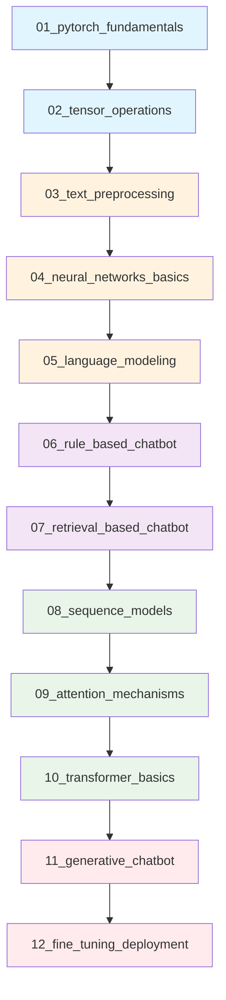
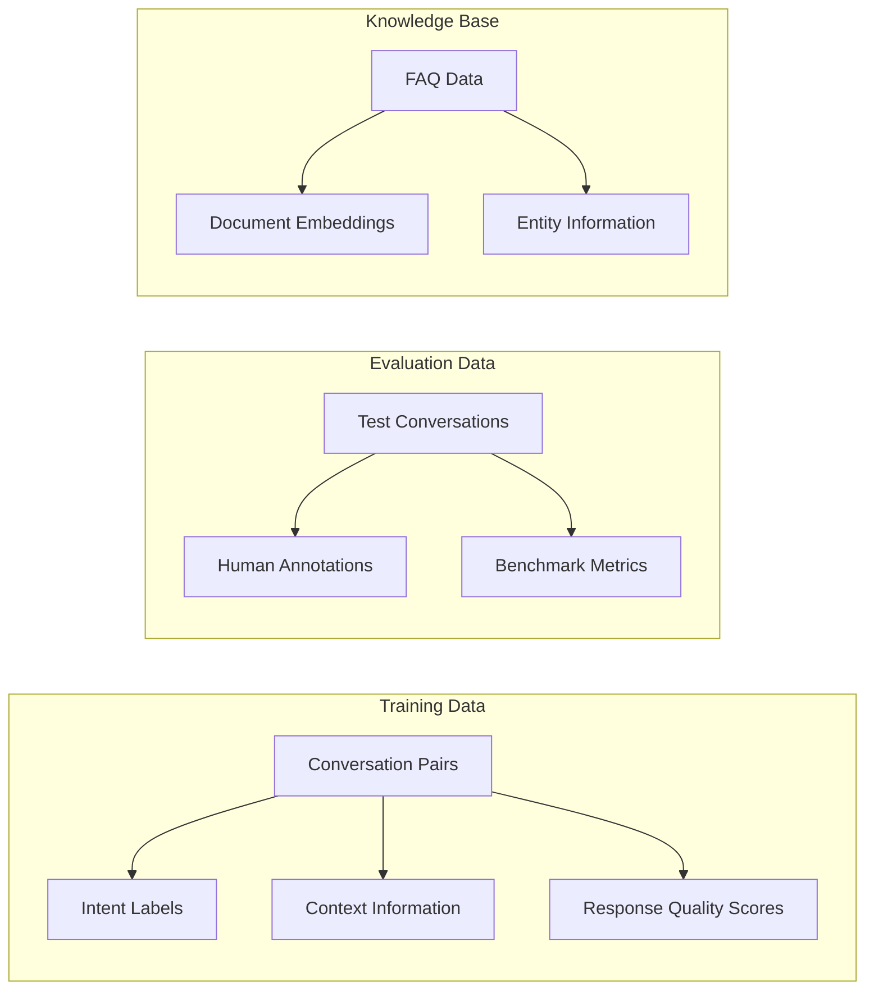
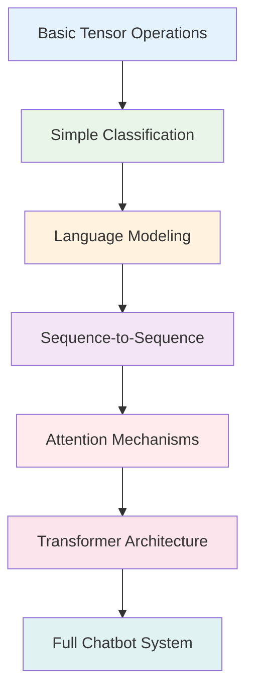

# Chatbot-Qoder: Comprehensive Chatbot Tutorial Series Design

## Overview

The Chatbot-Qoder tutorial series is a comprehensive educational program designed to guide learners from basic PyTorch fundamentals to advanced chatbot implementation. This tutorial series will be implemented in the `courses/chatbot-qoder/` directory, building upon the existing PyTorch learning environment while introducing specialized chatbot development concepts.

### Educational Philosophy
- **Progressive Learning**: Each notebook builds upon previous concepts with clear prerequisites
- **Hands-on Practice**: Emphasis on working examples over theoretical discussions
- **Comprehensive Documentation**: Extensive comments, docstrings, and markdown explanations
- **Real-world Applications**: Practical examples using realistic conversation datasets

### Target Audience
- Machine learning students with basic Python knowledge
- Developers new to PyTorch and NLP
- Practitioners transitioning from other ML frameworks to PyTorch
- Educators seeking structured chatbot development curriculum

## Architecture

### Learning Progression Flow



### Project Structure

```mermaid
graph TB
    root[courses/chatbot-qoder/] --> README.md
    root --> notebooks[notebooks/]
    root --> data[data/]
    root --> models[models/]
    root --> utils[utils/]
    root --> configs[configs/]
    
    notebooks --> nb01[01_pytorch_fundamentals.ipynb]
    notebooks --> nb02[02_tensor_operations.ipynb]
    notebooks --> nb03[03_text_preprocessing.ipynb]
    notebooks --> nb04[04_neural_networks_basics.ipynb]
    notebooks --> nb05[05_language_modeling.ipynb]
    notebooks --> nb06[06_rule_based_chatbot.ipynb]
    notebooks --> nb07[07_retrieval_based_chatbot.ipynb]
    notebooks --> nb08[08_sequence_models.ipynb]
    notebooks --> nb09[09_attention_mechanisms.ipynb]
    notebooks --> nb10[10_transformer_basics.ipynb]
    notebooks --> nb11[11_generative_chatbot.ipynb]
    notebooks --> nb12[12_fine_tuning_deployment.ipynb]
    
    data --> conversations[conversations/]
    data --> embeddings[embeddings/]
    data --> corpora[corpora/]
    
    models --> checkpoints[checkpoints/]
    models --> pretrained[pretrained/]
    
    utils --> text_utils.py
    utils --> model_helpers.py
    utils --> training_helpers.py
    utils --> evaluation_helpers.py
    utils --> chatbot_helpers.py
    
    configs --> model_configs.py
    configs --> training_configs.py
    configs --> data_configs.py
```



## Tutorial Notebook Specifications

### Foundation Level (Notebooks 1-5)

#### 01_pytorch_fundamentals.ipynb
**Learning Objectives:**
- Understand tensor creation, manipulation, and operations
- Learn autograd fundamentals for automatic differentiation
- Implement basic gradient descent from scratch
- Explore device management (CPU/GPU/MPS)

**Key Components:**
- Tensor creation methods and data types
- Mathematical operations and broadcasting
- Autograd mechanics with computation graphs
- Basic optimization loops
- Device compatibility testing

**Practical Exercise:** Build a simple linear regression model from scratch

#### 02_tensor_operations.ipynb
**Learning Objectives:**
- Master advanced tensor manipulations for text processing
- Understand tensor indexing, slicing, and reshaping
- Learn broadcasting rules and memory efficiency
- Implement custom tensor operations

**Key Components:**
- Advanced indexing and masking operations
- Tensor concatenation and stacking
- Memory-efficient operations
- Custom tensor functions
- Batch processing patterns

**Practical Exercise:** Implement text tokenization using pure tensor operations

#### 03_text_preprocessing.ipynb
**Learning Objectives:**
- Learn text cleaning and normalization techniques
- Understand tokenization strategies (word, subword, character)
- Implement vocabulary building and encoding
- Explore text augmentation methods

**Key Components:**
- Text cleaning pipelines (regex, unicode handling)
- Tokenization algorithms (BPE, WordPiece basics)
- Vocabulary management and OOV handling
- Text encoding and padding strategies
- Data augmentation for text

**Practical Exercise:** Build a complete text preprocessing pipeline for conversation data

#### 04_neural_networks_basics.ipynb
**Learning Objectives:**
- Understand nn.Module and parameter management
- Learn forward/backward pass mechanics
- Implement common layer types from scratch
- Explore initialization strategies

**Key Components:**
- Custom nn.Module implementations
- Parameter initialization techniques
- Loss functions for classification and regression
- Optimizer selection and hyperparameter tuning
- Model checkpointing and loading

**Practical Exercise:** Create a multi-layer perceptron for text classification

#### 05_language_modeling.ipynb
**Learning Objectives:**
- Understand language modeling fundamentals
- Learn n-gram models and neural approaches
- Implement character and word-level models
- Explore perplexity and evaluation metrics

**Key Components:**
- Statistical language models (n-gram)
- Neural language model architectures
- Training strategies for language modeling
- Evaluation metrics (perplexity, BLEU)
- Text generation techniques

**Practical Exercise:** Build a character-level language model for simple text generation

### Application Level (Notebooks 6-8)

#### 06_rule_based_chatbot.ipynb
**Learning Objectives:**
- Understand rule-based conversation systems
- Learn pattern matching and response generation
- Implement intent recognition systems
- Explore dialogue state management

**Key Components:**
- Pattern matching with regular expressions
- Intent classification using simple models
- Response template systems
- Context tracking and state management
- Rule prioritization and conflict resolution

**Practical Exercise:** Create a customer service chatbot with predefined rules

#### 07_retrieval_based_chatbot.ipynb
**Learning Objectives:**
- Learn information retrieval fundamentals
- Understand embedding spaces and similarity metrics
- Implement response ranking systems
- Explore context-aware retrieval

**Key Components:**
- Text similarity metrics (cosine, Jaccard)
- Embedding generation (TF-IDF, word2vec, BERT)
- Vector databases and retrieval systems
- Response ranking and selection
- Context incorporation strategies

**Practical Exercise:** Build a FAQ chatbot using retrieval-based methods

#### 08_sequence_models.ipynb
**Learning Objectives:**
- Understand RNN, LSTM, and GRU architectures
- Learn sequence-to-sequence modeling
- Implement encoder-decoder frameworks
- Explore teacher forcing and inference strategies

**Key Components:**
- Recurrent neural network implementations
- LSTM/GRU cell mechanics
- Sequence-to-sequence architectures
- Attention mechanisms (basic)
- Beam search decoding

**Practical Exercise:** Create a simple sequence-to-sequence chatbot

### Advanced Level (Notebooks 9-12)

#### 09_attention_mechanisms.ipynb
**Learning Objectives:**
- Understand attention mechanism fundamentals
- Learn different attention variants (additive, multiplicative)
- Implement self-attention from scratch
- Explore attention visualization techniques

**Key Components:**
- Attention score computation methods
- Multi-head attention implementation
- Positional encoding strategies
- Attention mask handling
- Visualization and interpretation tools

**Practical Exercise:** Enhance seq2seq model with attention mechanisms

#### 10_transformer_basics.ipynb
**Learning Objectives:**
- Understand transformer architecture components
- Learn encoder-decoder attention patterns
- Implement transformer blocks from scratch
- Explore pre-training concepts

**Key Components:**
- Multi-head self-attention implementation
- Feed-forward network blocks
- Layer normalization and residual connections
- Positional encoding strategies
- Transformer training dynamics

**Practical Exercise:** Build a mini-transformer for dialogue generation

#### 11_generative_chatbot.ipynb
**Learning Objectives:**
- Learn generative model training strategies
- Understand sampling and decoding methods
- Implement conversation history handling
- Explore safety and bias considerations

**Key Components:**
- Generative training objectives
- Sampling strategies (top-k, nucleus)
- Conversation context management
- Response quality evaluation
- Safety filtering and bias mitigation

**Practical Exercise:** Create an end-to-end generative chatbot

#### 12_fine_tuning_deployment.ipynb
**Learning Objectives:**
- Learn model fine-tuning strategies
- Understand deployment considerations
- Implement model optimization techniques
- Explore monitoring and maintenance

**Key Components:**
- Transfer learning and fine-tuning
- Model quantization and optimization
- Deployment strategies (API, web interface)
- Performance monitoring
- Continuous learning approaches

**Practical Exercise:** Fine-tune and deploy a production-ready chatbot

## Data Architecture

### Dataset Structure



### Data Management Strategy

| Data Type | Format | Size | Usage |
|-----------|--------|------|-------|
| Simple QA Pairs | JSON | 1K pairs | Notebooks 6-8 |
| Conversation Logs | JSON | 5K dialogues | Notebooks 9-11 |
| Domain-specific FAQ | JSON | 500 entries | Notebook 7 |
| Pre-trained Embeddings | PyTorch tensors | Variable | Notebooks 7-12 |
| Model Checkpoints | .pth files | 10-500MB | All notebooks |

## Utility Modules

### text_utils.py
**Core Functions:**
- `tokenize_text()`: Multiple tokenization strategies
- `build_vocabulary()`: Vocabulary construction and management
- `encode_sequences()`: Text to tensor conversion
- `pad_sequences()`: Batch padding and masking
- `clean_text()`: Text preprocessing pipeline

### model_helpers.py
**Core Functions:**
- `create_model()`: Model factory with configuration
- `initialize_weights()`: Various initialization strategies
- `count_parameters()`: Model size analysis
- `save_checkpoint()`: Model persistence
- `load_checkpoint()`: Model restoration

### training_helpers.py
**Core Functions:**
- `train_epoch()`: Single epoch training loop
- `evaluate_model()`: Model evaluation pipeline
- `calculate_metrics()`: Performance metric computation
- `early_stopping()`: Training control logic
- `learning_rate_scheduler()`: LR scheduling strategies

### evaluation_helpers.py
**Core Functions:**
- `calculate_bleu()`: BLEU score computation
- `perplexity_score()`: Language model evaluation
- `response_relevance()`: Retrieval-based evaluation
- `conversation_quality()`: Dialogue assessment
- `human_evaluation_interface()`: Manual evaluation tools

### chatbot_helpers.py
**Core Functions:**
- `generate_response()`: Response generation interface
- `manage_context()`: Conversation history management
- `filter_responses()`: Safety and quality filtering
- `rank_candidates()`: Response ranking logic
- `interactive_chat()`: Command-line chat interface

## Training Strategy

### Progressive Complexity Approach



### Model Complexity Progression

| Notebook | Model Type | Parameters | Training Time | Memory Usage |
|----------|------------|------------|---------------|--------------|
| 01-03 | Linear Models | <10K | <5 min | <100MB |
| 04-05 | MLPs | 10K-100K | 5-15 min | 100-500MB |
| 06-07 | Retrieval Systems | N/A | Variable | 500MB-1GB |
| 08 | RNN/LSTM | 100K-1M | 15-30 min | 1-2GB |
| 09-10 | Attention/Transformer | 1M-10M | 30-60 min | 2-4GB |
| 11-12 | Full Systems | 10M+ | 1+ hours | 4GB+ |

## Testing Framework

### Unit Testing Structure
- **Model Testing**: Architecture verification and forward pass validation
- **Data Testing**: Preprocessing pipeline correctness
- **Training Testing**: Learning curve validation and convergence checks
- **Integration Testing**: End-to-end pipeline functionality

### Evaluation Metrics

#### Technical Metrics
- **Perplexity**: Language model quality assessment
- **BLEU Score**: Generated text quality evaluation
- **Retrieval Accuracy**: Information retrieval performance
- **Training Metrics**: Loss convergence and learning stability

#### Human Evaluation
- **Response Relevance**: How well responses address user inputs
- **Conversation Flow**: Natural dialogue progression assessment
- **Safety Assessment**: Harmful content detection and filtering
- **User Satisfaction**: Overall chatbot experience quality

## Implementation Guidelines

### Code Quality Standards

#### Documentation Requirements
```python
def example_function(text: str, max_length: int = 512) -> Dict[str, Any]:
    """
    Process input text for chatbot training.
    
    This function demonstrates the documentation standard for all tutorial code.
    Every function should include a clear description, parameter explanations,
    return value documentation, and usage examples.
    
    Args:
        text (str): Input text to process. Should be cleaned and normalized.
        max_length (int, optional): Maximum sequence length. Defaults to 512.
    
    Returns:
        Dict[str, Any]: Processing results containing:
            - 'tokens': List of token strings
            - 'token_ids': List of token indices
            - 'attention_mask': Binary mask for valid tokens
            - 'metadata': Processing metadata and statistics
    
    Example:
        >>> result = example_function("Hello, how are you?")
        >>> print(result['tokens'])
        ['hello', ',', 'how', 'are', 'you', '?']
    
    Notes:
        This function is designed for educational purposes and includes
        extensive error checking and logging for learning clarity.
    """
```

#### Error Handling Strategy
- **Comprehensive Validation**: Input validation with educational error messages
- **Graceful Degradation**: Fallback strategies when operations fail
- **Learning-Focused Errors**: Error messages that explain concepts
- **Debugging Support**: Extensive logging and intermediate state inspection

### Performance Considerations

#### Memory Management
- **Batch Size Optimization**: Dynamic batch sizing based on available memory
- **Gradient Checkpointing**: Memory-efficient training for large models
- **Data Loading**: Efficient data pipeline with prefetching
- **Model Optimization**: Techniques for reducing memory footprint

#### Computational Efficiency
- **GPU Utilization**: Optimal device usage patterns
- **Mixed Precision**: FP16 training where appropriate
- **Model Parallelism**: Strategies for handling large models
- **Caching**: Intelligent caching of expensive computations